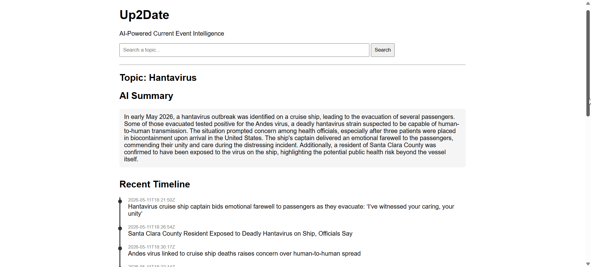

# Up2Date — AI Event Intelligence Dashboard

---

## Overview

Up2Date is an AI-powered web application that transforms live news data into structured event summaries, chronological timelines, and key statistics.

The application combines OpenAI API intelligence with real-time news sourcing to help users quickly understand developing world events.

Up2Date was designed to solve the problem of information overload. Many users struggle to piece together fragmented news sources into a clear understanding of what is happening, while others who are not constantly online need a fast, reliable briefing of current events they may have missed.

Rather than presenting raw articles, Up2Date reconstructs events into a structured intelligence format:

**Summary → Timeline → Statistics → Sources**

---

## Live Demo

### Hantavirus Event (Full AI Processing Pipeline)

This demo shows real-time processing where raw news articles are transformed into structured intelligence within seconds.

---

## Features

- AI-generated event summaries (multi-source synthesis)
- Chronological event reconstruction (timeline generation)
- Extracted real-world statistics (deaths, cases, totals when available)
- Live news aggregation via NewsAPI
- Clean structured dashboard interface
- Separation of narrative, timeline, and statistical layers

---

## How It Works

1. User enters a topic (e.g., “Hantavirus outbreak”)
2. NewsAPI fetches relevant recent articles
3. Articles are filtered and clustered to remove noise
4. OpenAI processes the data into:
   - A structured summary
   - A chronological timeline
   - Key statistical insights
5. Results are rendered in a structured dashboard UI

---

## System Design

Up2Date uses a multi-stage pipeline:

- News ingestion via NewsAPI
- Article clustering and filtering
- AI processing via OpenAI API
- Structured output generation (summary, timeline, stats)
- Web rendering via Flask frontend

---

## What This Project Demonstrates

- API integration (OpenAI + NewsAPI)
- Prompt engineering for structured outputs
- Backend development with Flask
- Data transformation pipelines
- Handling real-world unstructured data
- Frontend/backend integration

---

## Technologies Used

- Python
- Flask
- OpenAI API
- NewsAPI
- HTML / CSS

---

## Limitations

- Dependent on NewsAPI availability and article freshness
- Timeline accuracy depends on source data quality
- AI-generated outputs may vary slightly between runs

---

## Screenshots

### AI Summary

### Event Timeline & Statistics

### Latest Articles

---

## Future Improvements

- Dark mode UI
- Clickable timeline events with source links
- Smarter multi-event clustering (multiple stories at once)
- Live deployment (Render / Railway / Vercel)
- User accounts and saved event reports
- Improved fact verification scoring system

---

## Author

Denver Strange
