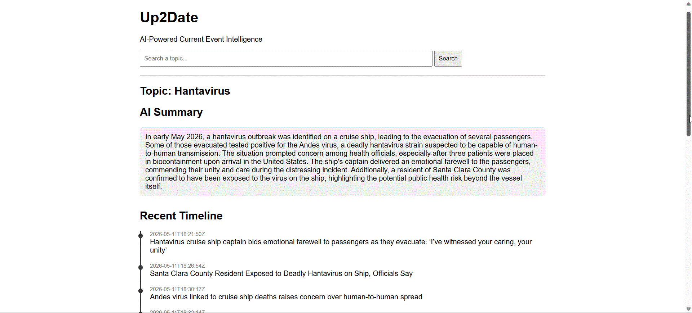
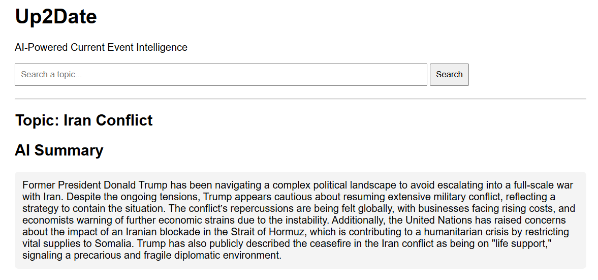
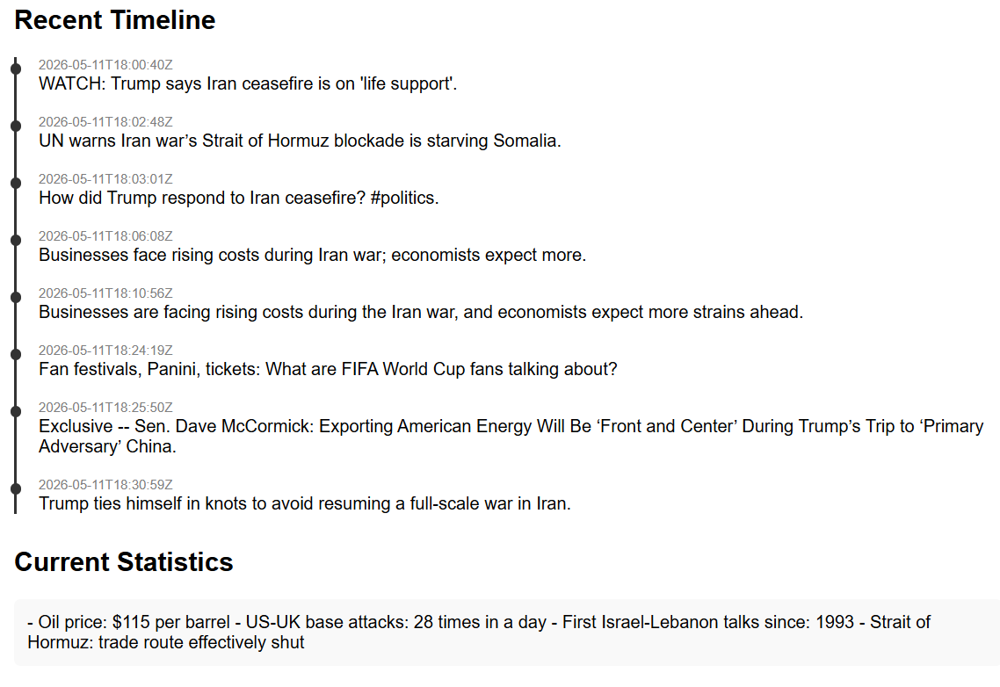
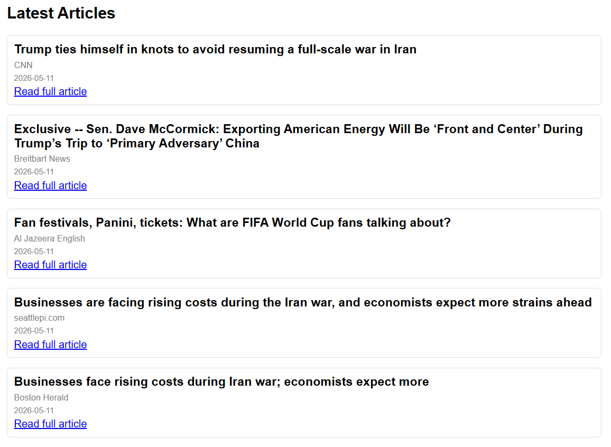

# Up2Date — AI Event Intelligence Dashboard

## Overview

Up2Date is an AI-powered web application that transforms live news data into structured event summaries, chronological timelines, and key statistics.

The application combines OpenAI API intelligence with real-time news sourcing to help users quickly understand developing world events.

Up2Date was designed to solve the problem of information overload. Many users struggle to piece together fragmented news sources into a clear understanding of what is happening, while others who are not constantly online need a fast, reliable briefing of current events they may have missed.

Rather than presenting raw articles, Up2Date reconstructs events into a structured intelligence format: **Summary → Timeline → Statistics → Sources**.

---

## Live Demo

### Hantavirus Event (Full AI Processing Pipeline)

---

## Features

- AI-generated event summaries (multi-source synthesis)
- Chronological event reconstruction (timeline generation)
- Extracted real-world statistics (deaths, cases, totals when available)
- Live news aggregation via NewsAPI
- Clean structured dashboard interface
- Separation of narrative, timeline, and factual data layers

---

## System Design

Up2Date uses a multi-stage pipeline:

1. NewsAPI retrieves relevant articles
2. Articles are filtered and clustered
3. OpenAI generates:
   - Event summary
   - Chronological timeline
   - Statistical insights
4. Data is rendered in a structured web interface

---

## Technologies Used

- Python
- Flask
- OpenAI API
- NewsAPI
- HTML / CSS
- JavaScript (basic UI behavior)

---

## Challenges Solved

- Removing irrelevant or unrelated news contamination
- Structuring unformatted AI output into usable JSON
- Separating summary, timeline, and statistical reasoning layers
- Handling inconsistent real-world news data formats
- Preventing duplicate or conflicting timeline events

---

## 📸 Screenshots

### AI Summary

### Event Timeline & Statistics

### Latest Articles

---

## Future Improvements

- Dark mode UI
- Clickable timeline events with source links
- Smarter multi-event clustering (multiple stories at once)
- Live deployment (Render / Railway / Vercel)
- User accounts and saved event reports
- Improved fact verification scoring system

---

## Author

Denver Strange
